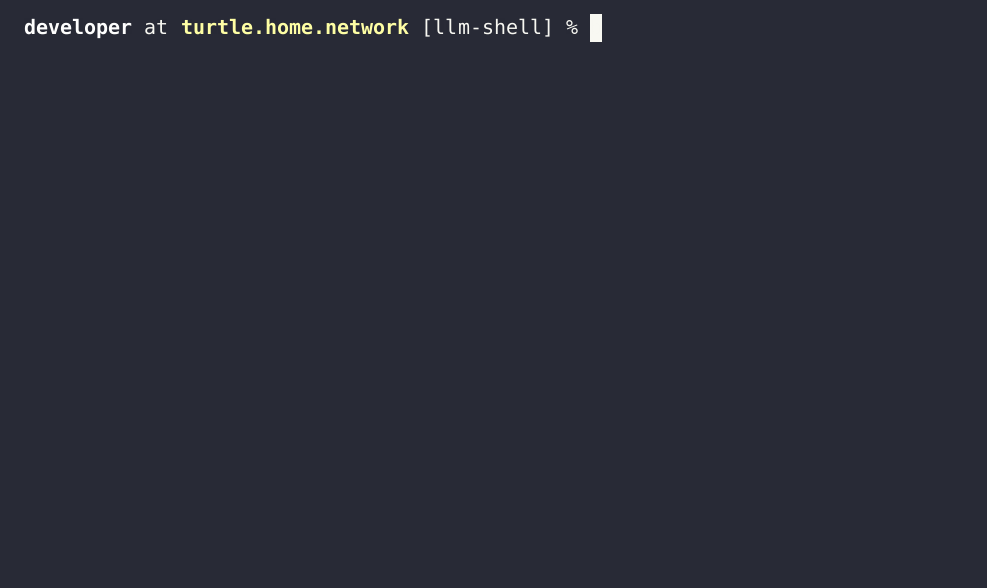

## About

llm-shell is a command-line utility that provides a unified interface to multiple
Large Language Models (LLMs). It serves as both a demo of the
[llmrb/llm](https://github.com/llmrb/llm) library and a tool to help improve
the library through real-world usage and feedback. Jump to the [Demos](#demos) 
section to see it in action!

## Features

- 🌟 Unified interface for multiple Large Language Models (LLMs)
- 🤝 Supports Gemini, OpenAI, Anthropic, and Ollama
- 📤 Attach local files as conversation context
- 🔧 Extend with your own functions and tool calls
- 📝 Advanced Markdown formatting and output

## Demos

<details>
  <summary><b>1. Tool calls</b></summary>
  
</details>

<details>
  <summary><b>2. File discussion</b></summary>
  
</details>

## Customization

#### Functions

The `~/.llm-shell/tools/` directory can contain one or more
[llmrb/llm](https://github.com/llmrb/llm) functions that the
LLM can call once you confirm you are okay with executing the
code locally (along with any arguments it provides). See the
earlier demo for an example.

An LLM function generally looks like this, and it can be dropped
into the `~/.llm-shell/tools/` directory. This function is the one
from the demo earlier, and I saved it as `~/.llm-shell/tools/system.rb`.
The function's return value is relayed back to the LLM:

```ruby
LLM.function(:system) do |fn|
  fn.description "Run a shell command"
  fn.params do |schema|
    schema.object(command: schema.string.required)
  end
  fn.define do |params|
    `#{params.command}`
  end
end
```

## Settings

#### YAML

The console client can be configured at the command line through option switches,
or through a YAML file. The YAML file can generally contain the same options that
could be specified at the command line. For cloud providers the token is the only
required parameter, everything else has defaults. The YAML file is read from the
path `${HOME}/.llm-shell/config.yml` and it has the following format:

```yaml
# ~/.config/llm-shell.yml
openai:
  token: YOURTOKEN
  model: gpt-4o-mini
gemini:
  token: YOURTOKEN
  model: gemini-2.0-flash-001
anthropic:
  token: YOURTOKEN
  model: claude-3-7-sonnet-20250219
ollama:
  host: localhost
  model: deepseek-coder:6.7b
```

## Install

llm-shell can be installed via [rubygems.org](https://rubygems.org/gems/llm-shell)

	gem install llm-shell

## License

[BSD Zero Clause](https://choosealicense.com/licenses/0bsd/)
<br>
See [LICENSE](./LICENSE)
