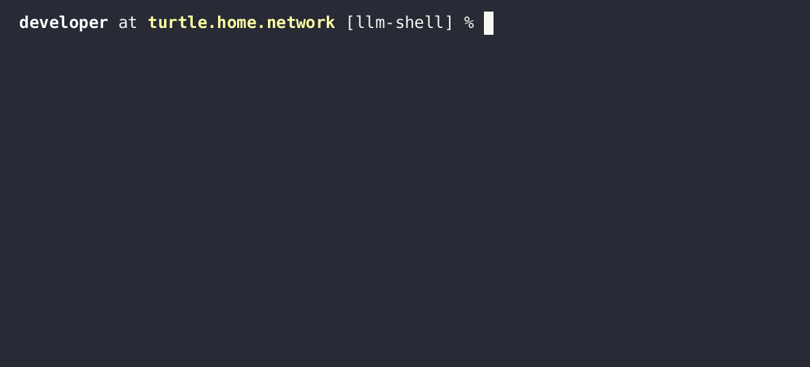

## About

llm-shell is a command line utility that provides an interface to multiple
large language models (LLMs). It primarily serves as a demo of the
[llmrb/llm](https://github.com/llmrb/llm) library, and it was implemented
to showcase the library's capabilities, and also to improve the library
from what was learned along the way.

## Features

- 🌟 A single interface for multiple Large Language Models (LLMs)
- 🤝 Gemini, OpenAI, Anthropic and Ollama support
- 📤 Attach local files as additional conversation context
- 🧠 Discuss local files you're working on or trying to understand

## Demos

#### Demo #1

## Install

llm-shell can be installed via [rubygems.org](https://rubygems.org/gems/llm-shell)

	gem install llm-shell

## License

[BSD Zero Clause](https://choosealicense.com/licenses/0bsd/)
 
See [LICENSE](./LICENSE)
